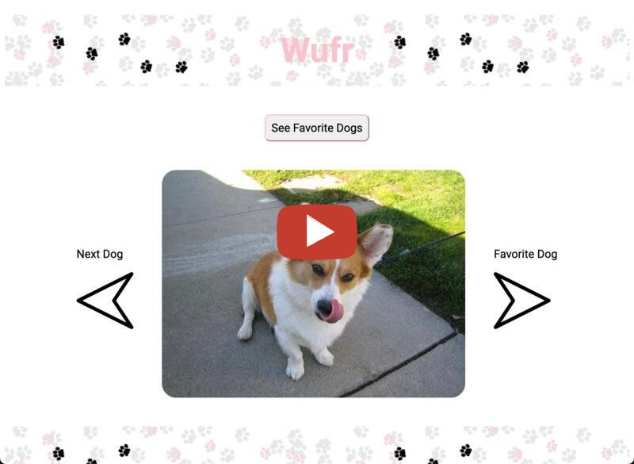

# Wufr: An App for Single Dogs

Wufr is a single-page web application that generates random images from the Dog CEO API and allows users to click left or right to either see new dog images or save their favorites, respectively. The app makes a fetch request for 10 random dog images. The user can save as many of the dog images as they would like to their favorites by clicking the right arrow, which generates a post request. Users can delete favorite dogs by clicking the dog image inside of the favorites container. The favorites container can be toggled open or closed to hide or show favorite dogs. Favorites dogs will persist through page-reloading as long as users are running the db.json file on their local host server.

## Walkthrough

## Installation:
Fork and clone a copy of the repository
Install dependencies by running $ npm install
Open the code in your preferred code editor
Open the index.html file in your browser
Run $ json-server --watch db.json
Check the command line to see where your local host is running and navigate to this location in your browser

## Usage:
Upon initial page render, users will see a random dog image with instructions to arrow left or arrow right, as well as a toggle button to show or hide favorite dogs.

Arrow left to see a new random dog image. Once the initial 10 random dog images have been viewed, a fetch request for 10 additional images is sent.

Arrow right to save a dog to the favorites container. If the favorites container is closed when a favorite dog is selected, the container will automatically toggle open to show all favorite dogs. 

The favorite dogs container holds all of the dogs the user has selected by using the right arrow. This container can be toggled open or closed using the toggle button. The user can click the image of a dog in the favorites container to remove it from their favorites.

Upon page reload, the favorite dogs selected will persist in the favorite dogs container.

## Credits:
Paw-print image background image: https://www.istockphoto.com/illustrations/dog-paw-print-clip-art-pictures
Dog CEO API: https://dog.ceo/dog-api 
Favorites container background: https://www.transparenttextures.com/ 
Left and right arrow images: http://www.clker.com/
